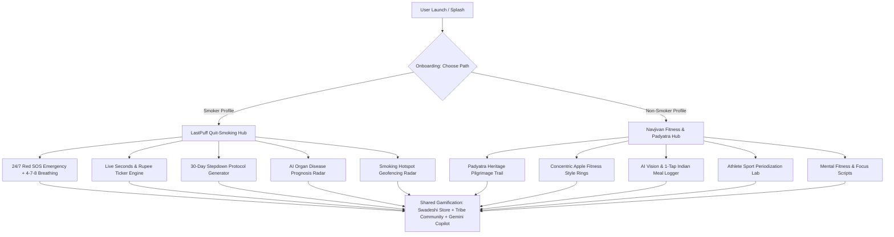

# 🌿 Navjivan × LastPuff

> **Smart India Hackathon 2025** — Production-Grade AI-Powered Dual-Profile Health, Smoking Cessation & Athletic Vitality Platform.

[](https://reactnative.dev/)
[](https://expo.dev/)
[](https://nodejs.org/)
[](https://expressjs.com/)
[](https://mongodb.com/)
[](https://deepmind.google/technologies/gemini/)
[](https://www.typescriptlang.org/)

---

## 🌟 Executive Summary

**Navjivan × LastPuff** is an enterprise-grade, dual-profile wellness ecosystem tailored for the Indian demographic. It addresses two critical health frontiers:

1. **🚭 LastPuff (Smoker Profile)**: Evidence-based smoking cessation, live second-by-second smoke-free recovery ticker, 24/7 craving emergency SOS tools, 4-7-8 pranayama breathing pacer, 30-day stepdown protocol, disease risk radar, and crowd-sourced geofenced smoking danger zones.
2. **⚡ Navjivan (Fitness & Wellness Profile)**: AI-periodized athletic conditioning (*Cricket, Running, Badminton, Kabaddi, Football*), **Padyatra** virtual Indian heritage pilgrimage step tracking (*Dandi March, Char Dham, Everest Trail*), Gemini Vision camera meal macro analyzer, and cognitive focus scripts.
3. **🇮🇳 Swadeshi Gamification & SaaS**: 5-tier level progression system with redeemable vouchers for Indian wellness brands (*MuscleBlaze, The Whole Truth, Cult.fit, Khadi India, boAt Lifestyle*), and a 3-tier subscription paywall.

---

## 📱 Dual-Profile Architecture



---

## 🚀 Key Feature Modules

### 1. 🚭 Smoker Profile (LastPuff)
- **Live Recovery Ticker Engine (`LiveTimerTicker`)**: Real-time ticker counting smoke-free seconds (`02d : 14h : 38m : 42s`) with live rupee savings calculator, cigarettes avoided, and estimated life regained.
- **24/7 Red SOS Craving Shield (`app/sos.tsx`)**:
  - **🧘 Guided 4-7-8 Pranayama Breathing**: Physical spring expansion on 4s Inhale, 7s Hold, and 8s Exhale with rhythmic haptics.
  - **🎚️ Craving Distress Slider (1-10)**: Ambient aura dynamically shifts from calming amber to emergency crimson.
  - **🎮 Panic Distraction Mini-Games**: 60-second *Bubble Burst* (multi-touch popping physics + combo multiplier) and Zen *Focus Flow* pattern matching.
  - **📞 Direct Lifeline**: Toll-free National Tobacco Quitline (`1800-11-2356`) + instant Guardian Emergency SMS alert (`expo-sms`).
- **AI Disease Risk Analyzer (`app/disease-risk.tsx`)**: Pack-year calculations with 5 organ radial recovery meters (*COPD, Lung Cancer, Heart Disease, Stroke, PVD*).
- **30-Day Stepdown Protocol (`app/quit-plan.tsx`)**: Daily cigarette caps, streak tracking, and Gemini AI quit plan generator.

### 2. ⚡ Fitness & Wellness Profile (Navjivan)
- **🇮🇳 Padyatra Virtual Pilgrimage (`app/padyatra.tsx`)**: Pedometer-driven step tracking across historical routes (*Dandi Salt March (390 km)*, *Char Dham (1,200 km)*, *Everest Trail*) with interactive landmark pins and trivia cards.
- **⭕ Concentric Health Rings (`ConcentricRings`)**: Triple-ring SVG visualizer tracking Daily Steps, Active Cardio minutes, and Hydration score.
- **🥗 Nutrition & 1-Tap Indian Meal Scanner (`app/nutrition.tsx`)**: Point camera at any plate for Gemini Vision nutrient analysis or 1-tap log Indian dishes (*Paneer Tikka, Dal Tadka, Masala Dosa, Chicken Biryani*) + daily 3.0L water bottle tracker.
- **🏋️ Athlete Performance Lab (`app/athlete-training.tsx`)**: Sport-specific periodization (*Cricket, Running, Badminton, Kabaddi, Football*) across Base, Power, and Agility phases.
- **🧠 Mental Fitness & Focus (`app/mental-health.tsx`)**: AI confidence scripts, mood journal, and focus affirmations.

### 3. 🤖 Live Agentic AI & Swadeshi Gamification
- **Live Gemini 3.6 Flash Copilot (`app/chatbot.tsx`)**: 24/7 intelligent coach providing empathetic smoking cessation tactics or athletic periodization tips.
- **Autonomous AI Goals Agent (`app/goals.tsx`)**: Synthesizes 3 personalized daily quests based on live user streak and recovery data.
- **XP & 5-Tier Leveling**: Earn XP by resisting cravings, walking steps, completing workouts, and checking in.
- **Brand Partner Store (`app/rewards/index.tsx`)**: Redeem XP for genuine discount vouchers with Indian brand partners (*MuscleBlaze, The Whole Truth, Cult.fit, Khadi India, boAt*).
- **3-Tier SaaS Paywall (`app/subscription.tsx`)**: Free Starter, Navjivan Pro (₹299/mo), and Elite Clinical Concierge (₹699/mo).

---

## 🏗️ Technical Architecture

### Frontend Stack
- **Framework**: React Native with Expo SDK 57 (Expo Router file-based navigation)
- **Type Safety**: TypeScript Strict Mode (`npx tsc --noEmit` clean: 0 errors, 0 warnings)
- **Styling**: Obsidian Dark Luxury palette (`#050508` OLED base, `#0E0E17` glass surface), specular highlights, and neon glow accents (`#00F5A0`, `#8B5CF6`)
- **Animation**: `react-native-reanimated` (4.5.1) + `react-native-svg` custom charts
- **Sensors & Native APIs**: `expo-sensors` (Pedometer), `expo-location` (Geofencing), `expo-image-picker` (Camera Vision), `expo-haptics`, `expo-sms`

### Backend Stack
- **Runtime**: Node.js (ES Modules `"type": "module"`) + Express.js
- **Database**: MongoDB with Mongoose ODM (11 Schemas: `User`, `CravingLog`, `CigaretteLog`, `NutritionLog`, `StepLog`, `Goal`, `GeoHotspot`, `Reward`, `ChatMessage`, `Post`, `Comment`)
- **AI Engine**: Provider-agnostic `aiService.js` powered by **Google Gemini 3.6 Flash** with in-memory response caching, rate-limiting, and 4-second timeout failover
- **Security & Optimization**: Helmet headers, gzip compression, morgan logging, express-rate-limit

---

## 📦 Project Structure

```
navjivan-sih-project/
├── lastpuff-backend/
│   └── express-app/
│       ├── controllers/       # 12 REST Controllers (Auth, AI, Goals, SOS, Nutrition, etc.)
│       ├── middlewares/       # JWT Authentication & Multer upload middleware
│       ├── models/            # 11 Mongoose Schemas (User, CravingLog, Goal, etc.)
│       ├── routes/            # 13 Route Groups (/api/auth, /api/ai, /api/goals, etc.)
│       ├── services/          # aiService.js (Gemini), notifications.js, cronJobs.js
│       └── server.js          # Express server with rate limiting & security
│
└── lastpuff-frontend/
    ├── app/
    │   ├── (tabs)/            # Tabs: Home, Explore, Geofencing, Stats, Profile
    │   ├── games/             # Bubble Burst & Zen Focus Flow mini-games
    │   ├── onboarding/        # Dual-profile onboarding & specialized setup
    │   ├── rewards/           # XP Leveling & Swadeshi Brand Store
    │   ├── athlete-training   # Sport-specific periodization lab
    │   ├── chatbot.tsx        # 24/7 Gemini Copilot
    │   ├── disease-risk.tsx   # Pack-year organ recovery radar
    │   ├── fitness-plans.tsx  # Interactive workout mode & rest timers
    │   ├── goals.tsx          # Agentic AI daily missions & goal tracker
    │   ├── mental-health.tsx  # Focus affirmations & mood tracker
    │   ├── nutrition.tsx      # Gemini Vision meal scanner & water tracker
    │   ├── padyatra.tsx       # Historical pilgrimage step tracker
    │   ├── quit-plan.tsx      # 30-day stepdown quit protocol
    │   ├── sos.tsx            # 24/7 Red SOS Craving Shield & 4-7-8 breathing
    │   └── subscription.tsx   # 3-tier SaaS paywall
    │
    ├── components/ui/         # LiveTimerTicker, ConcentricRings, QuickActionDock, GlassCard
    ├── constants/theme.ts     # Obsidian OLED design tokens & gradients
    ├── context/               # AuthContext.tsx & UserContext.tsx
    └── services/api.ts        # Typed Axios client with dynamic host discovery
```

---

## ⚡ Quick Start Guide

### 1. Prerequisites
- **Node.js**: v18.0.0 or newer
- **Expo Go**: Installed on Android / iOS device

### 2. Start Backend API
```bash
cd "lastpuff-backend/express-app"
npm install
npm run dev
# API running on http://localhost:5000 (0.0.0.0)
```

### 3. Start Expo Frontend App
```bash
cd "lastpuff-frontend"
npm install
npx expo start -c
```
*Scan the terminal QR code using **Expo Go** on Android or the Camera app on iOS.*

---

## 📜 Documentation & References
- **[API Documentation (API.md)](./API.md)**: Full REST endpoints specification.
- **[Contributing Guidelines (CONTRIBUTING.md)](./CONTRIBUTING.md)**: Coding standards and workflow.

---

## 🏆 Smart India Hackathon 2025
*Crafted with passion for a healthier, smoke-free, and athletic India.*
